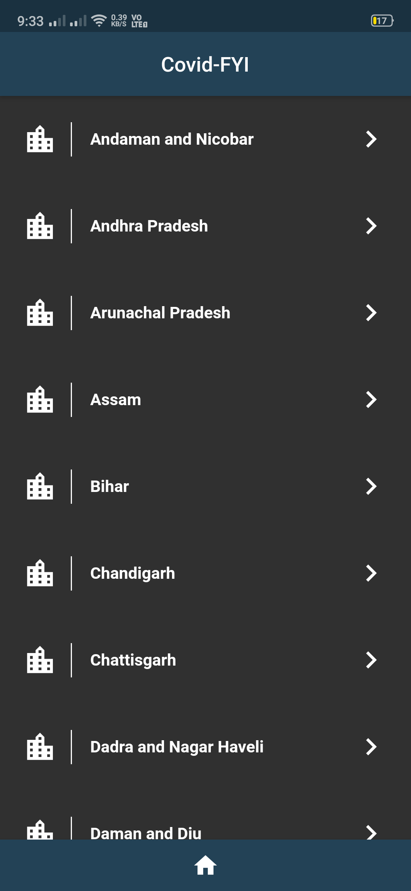
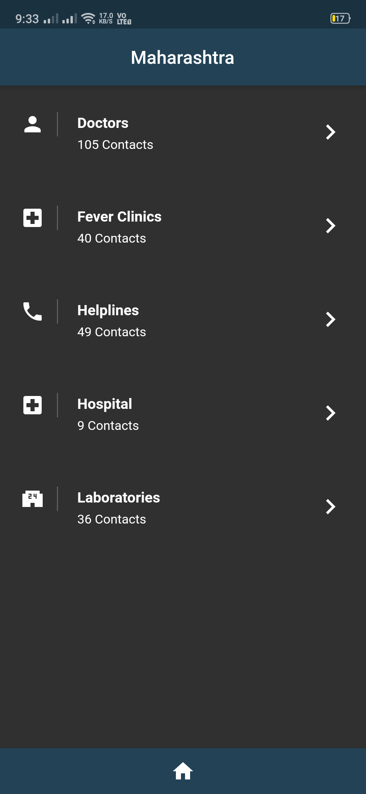
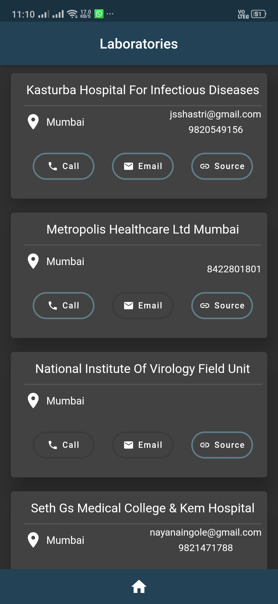

# covidfyi

Application for CovidFYI.in

## Getting Started

The data is provided by the covidfyi.in Restapi

# Screenshots:

### Starting Screen / Splash Screen

### States List

### Info-types of the States

### Contact Card

Only the data available get a blue coloured bordering indicating the data is available

# Get packages for all flutter projects

- Once you have cloned this repo, navigate to the root of this repo.
- Next run `flutter pub get`
- After getting all the packages run `flutter run`
- Done!

